[](https://confluence.jetbrains.com/display/ALL/JetBrains+on+GitHub)
[](https://www.apache.org/licenses/LICENSE-2.0)

# Introduction to Coroutines and Channels Hands-On Lab

This repository is the code corresponding to the
[Introduction to Coroutines and Channels](https://play.kotlinlang.org/hands-on/Introduction%20to%20Coroutines%20and%20Channels/01_Introduction)
Hands-On Lab. 

## How to run

Run `Main.kt`. 

Note: To enable the logging of the coroutine used, open Run | Edit configurations... and add the `-Dkotlinx.coroutines.debug` VM option:

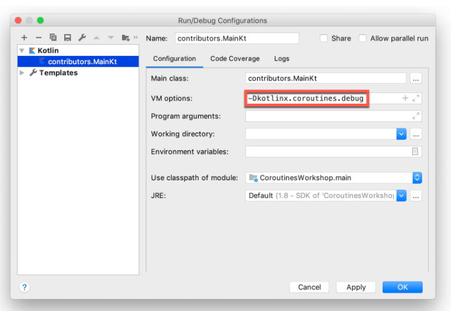

## Running modes

### BLOCKING

This log demonstrates that all the results were logged from the main thread. When we run the code under a blocking request, we will find that the window will freeze and won't react to input until the loading is finished. All the requests are executed from the same thread as we've called `loadContributorsBlocking` from, which is the main UI thread. This main thread gets blocked, and that explains why the UI is frozen.

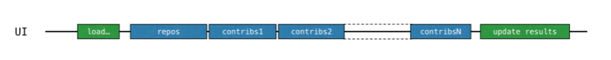

### BACKGROUND

We've moved the whole loading logic to the background thread, but it's still not the best use of resources. All the loading requests go sequentially one after another, and while waiting for the loading result, the thread is blocked, but it could be occupied with some other tasks. Specifically, it could start another loading, so that the whole result is received earlier!

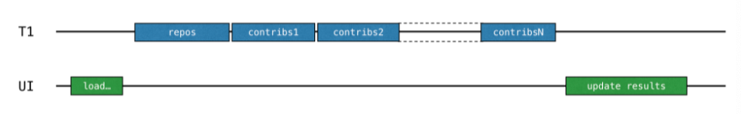

### CALLBACKS

Handling the data for each repository should be divided into two parts: first the loading, then processing the resulting response. The second "processing" part should be extracted into a callback. The loading for each repository can then be started before the result for the previous repository is received (and the corresponding callback is called):

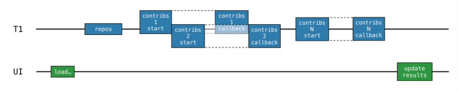

### RX

RxJava uses different threads to run the contributor calls in parallel.

### SUSPEND

Coroutines are often called light-weight threads. That means we can run code on coroutines similar to how we run code on threads. The operations that were blocking before, can now suspend the coroutine instead.

`launch` starts a new computation. This computation is responsible for loading the data and showing the results. This computation is suspendable: while performing the network requests, it gets "suspended" and releases the underlying thread. When the network request returns the result, the computation is resumed.

Such a suspendable computation is called a coroutine, so, we'll simply say that in this case, launch starts a new coroutine that is responsible for loading data and showing the results.

**Coroutines are computations that run on top of threads and can be suspended. When a coroutine is "suspended", the corresponding computation is paused, removed from the thread, and stored in memory. Meanwhile, the thread is free to be occupied with other activities**:

When the computation is ready to be continued, it gets returned to a thread (but not necessarily to the same one).

Each "contributors" request now waits for the result via the suspension mechanism. First, the new request is sent. Then, while waiting for the response, the whole "load contributors" coroutine becomes suspended (the one we've discussed above started by the launch function). The coroutine resumes only after the corresponding response is received:

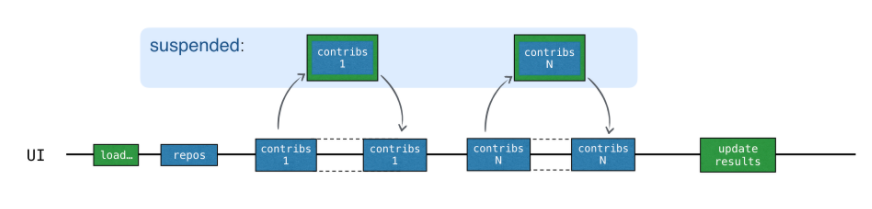

While the response is waiting to be received, the thread is free to be occupied with other tasks. That's why when users are loaded via the `SUSPEND` option, the UI stays responsive, despite all the requests taking place on the main UI thread. 

In this version, while waiting for the result, we don't reuse the thread for sending other requests, because we have written our code in a sequential way. The new request is sent only when the previous result is received. `suspend` functions treat the thread fairly and don't block it for "waiting", but it doesn't yet bring any concurrency to the picture. 

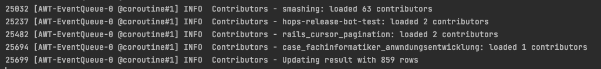

### CONCURRENT

Kotlin coroutines are extremely inexpensive in comparison to threads. Each time when we want to start a new computation asynchronously, we can create a new coroutine.

When starting each "contributors" request in a new coroutine, all the requests are started asynchronously. A new request can be sent before the result for the previous one is received:

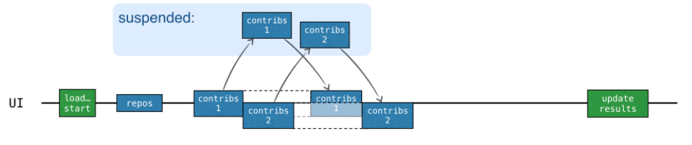

All the coroutines still run on the main UI thread. We haven't yet employed multithreading in any way, but we already have the benefits of running coroutines concurrently!

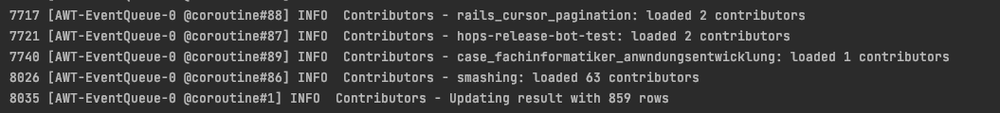

`CoroutineDispatcher` determines what thread or threads the corresponding coroutine should be run on. If we don't specify one as an argument, then async will use the dispatcher from the outer scope.

`Dispatchers.Default` represents a shared pool of threads on JVM. This pool provides a means for parallel execution.

Each coroutine can be started on one thread from the thread pool and resumed on another:

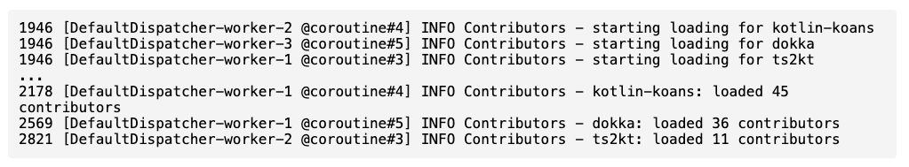

For instance, in this log excerpt, `coroutine#4` is started on the thread `worker-2` and continued on the thread `worker-1`.

### NOT_CANCELABLE

#### Structured concurrency

**Coroutine scope is responsible for the structure and parent-child relationships** between different coroutines. We always start new coroutines inside a scope. **Coroutine context stores additional technical information used to run a given coroutine**, like the coroutine custom name, or the dispatcher specifying the threads the coroutine should be scheduled on.

When `launch`, `async`, or `runBlocking` are used to start a new coroutine, they automatically create the corresponding scope.When starting a new coroutine inside `runBlocking`, `launch`, or `async` it is started automatically inside the scope.

It is possible to create a new scope without starting a new coroutine. The `coroutineScope` function does this. When we need to start new coroutines in a structured way inside a `suspend` function without access to the outer scope, for example inside `loadContributorsConcurrent`, we can create a new coroutine scope which automatically becomes a child of the outer scope that this `suspend` function is called from.

It's also possible to start a new coroutine from the global scope using `GlobalScope.async` or `GlobalScope.launch`. This will create a top-level "independent" coroutine.

The mechanism providing the structure of the coroutines is called "structured concurrency". Let's see what benefits structured concurrency has over global scopes:

* The scope is generally responsible for child coroutines, and their lifetime is attached to the lifetime of the scope.
* The scope can automatically cancel child coroutines if something goes wrong or if a user simply changes their mind and decides to revoke the operation.
* The scope automatically waits for completion of all the child coroutines. Therefore, if the scope corresponds to a coroutine, then the parent coroutine does not complete until all the coroutines launched in its scope are complete.

When using `GlobalScope.async` there is no structure that binds several coroutines to a smaller scope. The coroutines started from the global scope are all independent; their lifetime is limited only by the lifetime of the whole application. It is possible to store a reference to the coroutine started from the global scope and wait for its completion or cancel it explicitly, but it won't happen automatically as it would with a structured one.

`NOT_CANCELABLE` mode uses Global scope to run the contributors calls instead of using the parent scope. This causes that the coroutines can't be canceled.

In `CONCURRENT` mode we use structured concurrency, we only need to cancel the parent coroutine and this automatically propagates cancellation to all the child coroutines.

### PROGRESS 

It runs the requests sequentially showing the updated results after each response: 

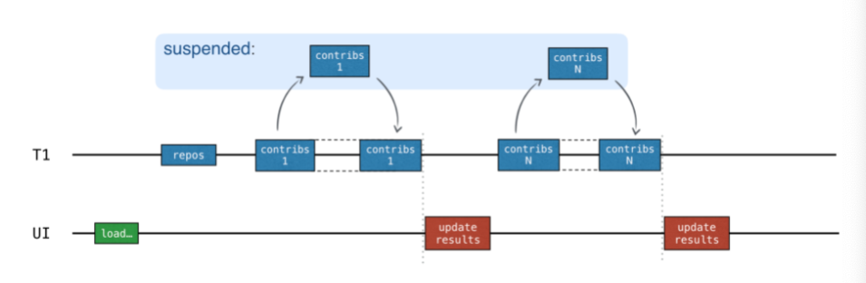

### CHANNELS

Channels are communication primitives that allow us to pass data between different coroutines. One coroutine can send some information to a channel, while the other one can receive this information from it.

A coroutine that sends (produces) information is often called a producer, and a coroutine that receives (consumes) information is called a consumer. When needed, many coroutines can send information to the same channel, and many coroutines can receive information from it:

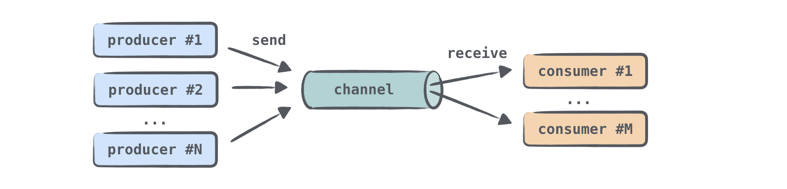

Note that when many coroutines receive information from the same channel, each element is handled only once by one of the consumers; handling it automatically means removing this element from the channel.

A channel can suspend `send` and `receive` operations. This happens when the channel is empty or full (the channel's size might be constrained, and then it can be full).

Several types of channels are defined in the library. They differ in how many elements they can internally store, and whether the `send` call can suspend or not. For all channel types, the `receive` call behaves in the same manner: it receives an element if the channel is not empty, and otherwise suspends.

* **Unlimited channel**: producers can send elements to this channel, and it will grow infinitely. The `send` call will never be suspended. If there's no more memory, you'll get an `OutOfMemoryException`.

* **Buffered channel**: Producers can send elements to this channel until the size limit is reached. All the elements are internally stored. When the channel is full, the next `send` call on it suspends until more free space appears. 

* **“Rendezvous” channel**: It's the same as creating a buffered channel with zero size. One of the functions (`send` or `receive`) always gets suspended until the other is called. If the `send` function is called and there's no suspended `receive` call ready to process the element, then send suspends. Similarly, if the `receive` function is called and the channel is empty - or in other words, there's no suspended `send` call ready to send the element - the receive call suspends. 

* **Conflated channel**: A new element sent to the conflated channel will overwrite the previously sent element, so the receiver will always get only the latest element. The `send` call will never suspend.


When you create a channel, you specify its type or the buffer size (if you need a buffered one). By default, a "Rendezvous" channel is created.

```
val rendezvousChannel = Channel<String>()
val bufferedChannel = Channel<String>(10)
val conflatedChannel = Channel<String>(CONFLATED)
val unlimitedChannel = Channel<String>(UNLIMITED)
```

We use a coroutine to request the list of contributors of each repo and send this list through a rendezvous channel. Then, we receive the list of users, aggregate it to the accumulated list and update the UI.

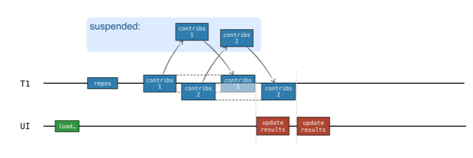

### FLOW

Channels are hot, this means that when we create the producer coroutine, it starts emitting and, if there is no consumer coroutine receiving the data, the producer keeps "working" without actually doing anything. If we open a channel we need to read from it or close it, it is like any other resource (File, network connection).


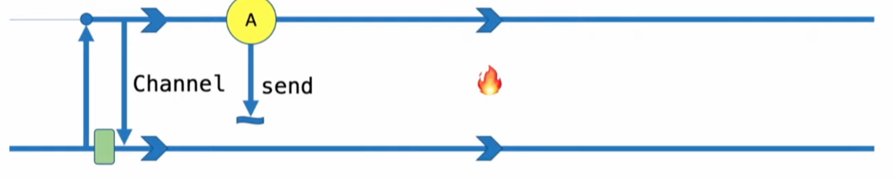

Flows are cold and solve the problems that we could have with Channels.

The flow doesn't start emitting until the `collect` function is called on it.  

A function returning a `Flow` doesn't need to be suspended because the code is not going to be executed until we call `collect`:

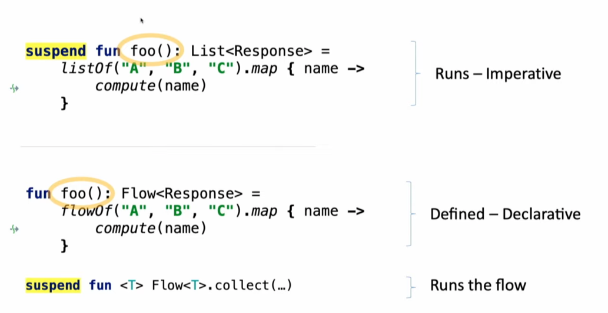

**Flow is reactive**, it processes each item when it is emitted instead of waiting for all the items to be emitted (like how would happen with a list).

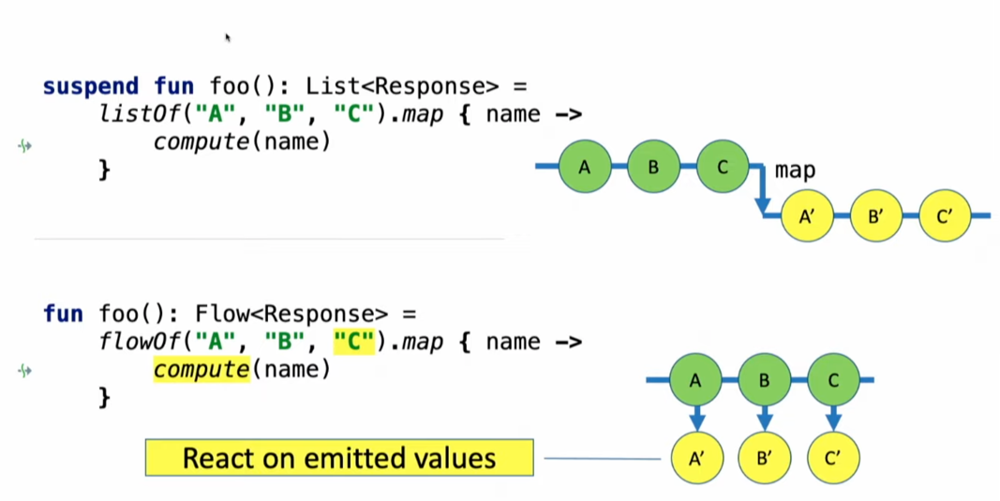

It is compatible with other reactive libraries that follow the reactive streams specification:

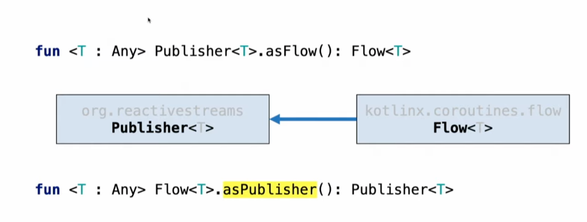


Flow has a simpler interface than RxJava:

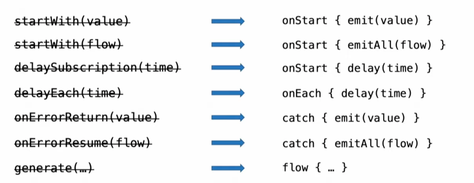


If the collection is slow for any reason, while collection is suspended, there is no more emissions. If our collector is slow just slows down the emitter that produces the values: we get Backpressure automatically.

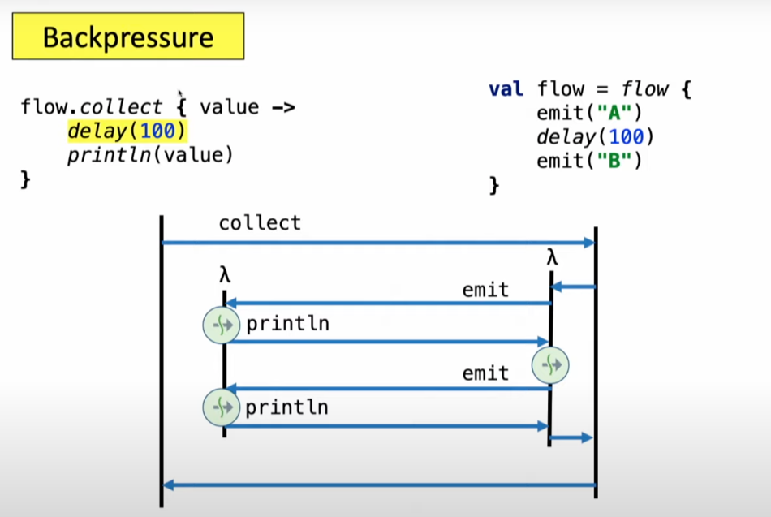

##### Flow is asynchronous yet sequential

Collection and processing of the emitted element run sequentially, if emitting an item takes 100ms and processing it takes 100ms, the total time for three items will be 700ms:

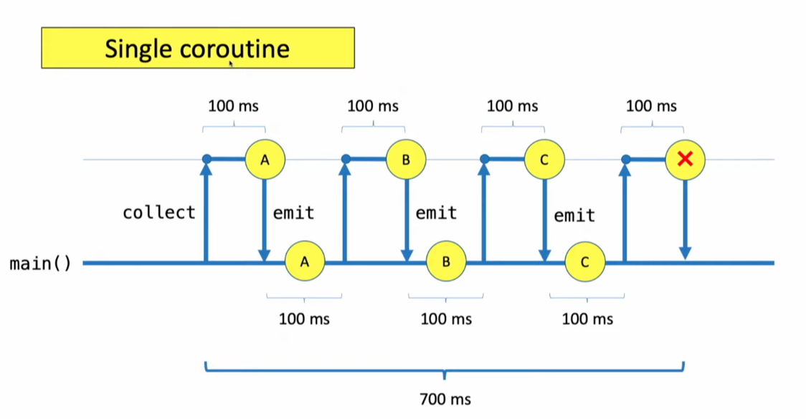

To make this call concurrent we can use `buffer()` . Collector and emitter working in parallel.  Behind the scense colelctor runs in a separate coroutine and there is channel sending data from the collecting coroutine to the processing one. 

##### Context preservation

The code is always going to be executed in the context were `collect` is called if we don't specify a different context. In case we specify a different dispatcher, it doesn't affect the `collect` lambda call:  

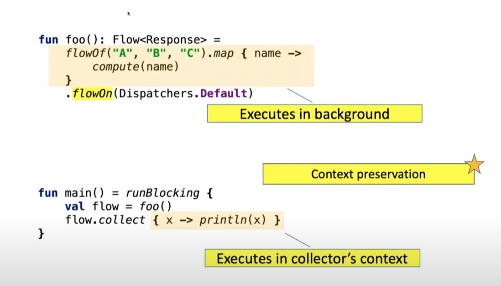

Up stream flow context never affects down stream context. When calling `collect` we don't need to know how `foo` is implemented, we know that the code executed in the main thread is going to be executed in the main thread.

Intermediate operators are applied to an upstream flow and return a downstream flow


## References

[Introduction to Coroutines and Channels](https://play.kotlinlang.org/hands-on/Introduction%20to%20Coroutines%20and%20Channels/01_Introduction)
[KotlinConf 2019: Asynchronous Data Streams with Kotlin Flow by Roman Elizarov](https://www.youtube.com/watch?v=tYcqn48SMT8&ab_channel=AndroidDevelopers)